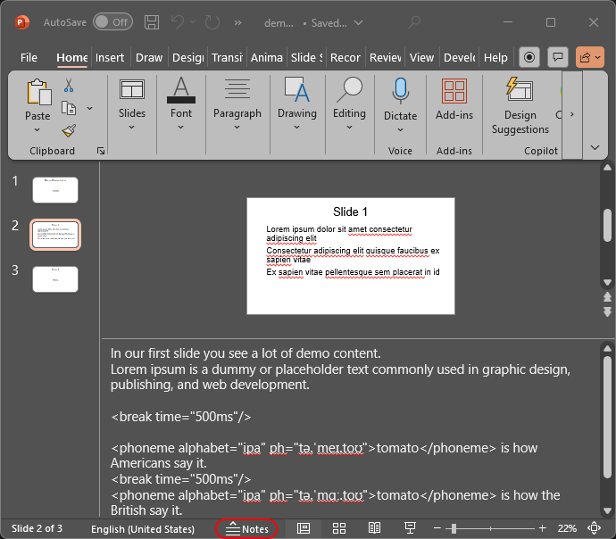
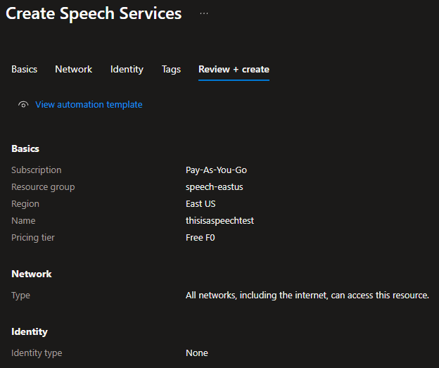

# PowerPoint Voiceover with Azure Text-to-Speech

## Description

This script can be used to create training videos from PowerPoint slides.  
Create your slides and on each slide add the voiceover text as notes. That Text in the notes will be used to create the voiceover.  

It is possible to add breaks in the voiceover and also pronounce words phonetically correct using SSML tags.



## Prerequirements

The script requires the Windows PowerPoint Desktop version being installed on your computer.  

## Setup

- create an Azure Speech service in your own Azure tenant
  
- add your resource key into the file resource_key.txt
- optional: adjust the template_ssml.txt to use your preferred voice and settings.

## Run script

- copy your PowerPoint file to this folder
- run the script (adjust at least PowerPoint filename and SpeechEndpoint region to match your environment)

```
.\create_voiceover.ps1 `
  -PptxFile ".\demo_presentation.pptx" `
  -SpeechEndpoint "https://<region>.tts.speech.microsoft.com/cognitiveservices/v1" `
  -SsmlTemplate ".\template_ssml.txt" `
  -AudioExt "mp3" `
  -ResourceKeyPath ".\resource_key.txt" `
  -OutputFolder ".\output"
```

## SSML Information

### Overall Settings

The SSML template will work out of the box.  

For more information about SSML read the following documentation:
https://learn.microsoft.com/en-us/azure/ai-services/speech-service/speech-synthesis-markup-voice

If you want to use a GUI to test the voices go to: 
https://speech.microsoft.com/portal 
You can go to the Voice Gallery and use the Audio Content Creation tool. 
It allows you to select voices, and test different voice settings (speed, pitch, ...). 

### SSML Tags in Voiceover

In you slides notes you can write SSML. This will work to pronounce Tomato:
```
<phoneme alphabet="ipa" ph="tə.ˈmeɪ.toʊ"> tomato </phoneme>
```

To add a short pause you can add:
```
<break time="500ms"/>
```

## Disclaimer

This is just a simple weekend project.  
This code was created with the help of ChatGPT.  
Only use it on trusted pptx files as there is no input validation. 
Special characters in the notes might break the script.  

Your notes will be uploaded to Microsoft servers and processed there to generate the audio files.  
The Azure Speech service offers a free tier and for higher consumption you need to use a paid tier. You will get billed for resource consumptions.  

Use at your own risk. You have been warned.
